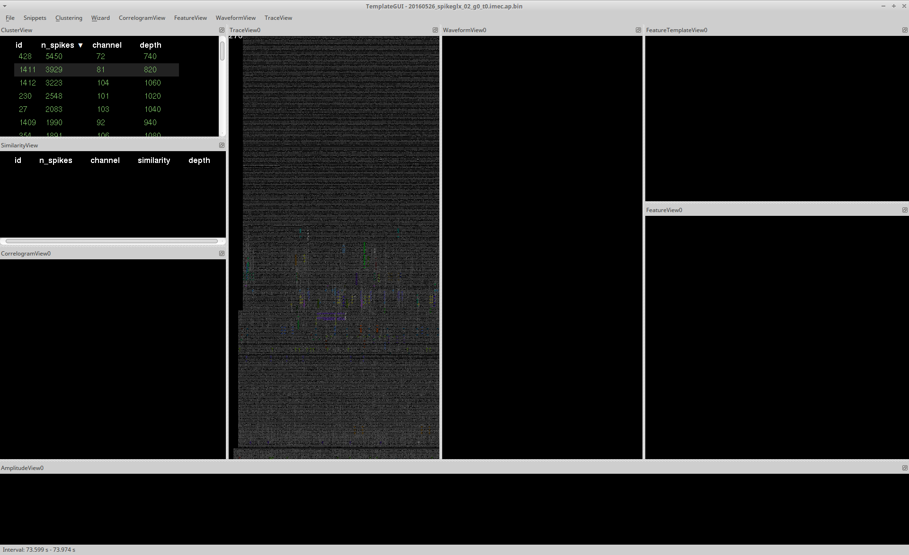
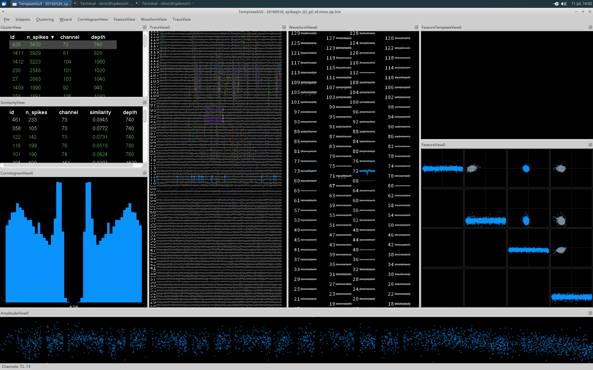
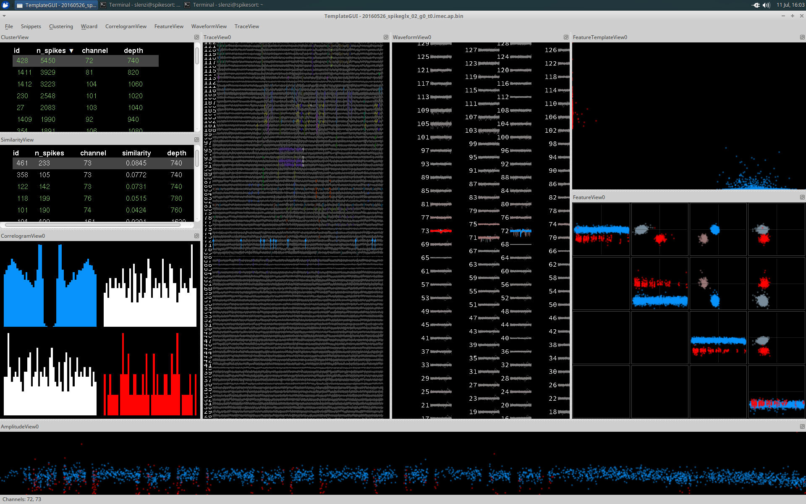
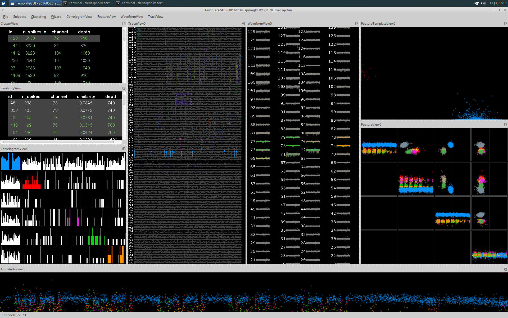
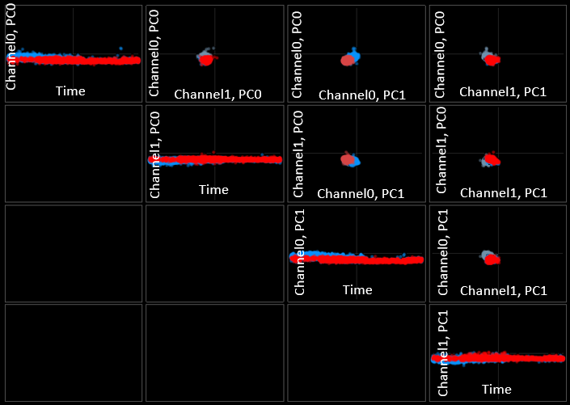

# Manual Clustering Practical User's Guide

The `phy-contrib.template-gui` module provides a graphical user interface for manual clustering of automatically sorted spikes.

Documentation contributed by Stephen Lenzi (Margrie Lab) and Nick Steinmetz

## Contents:
* [Installation and requirements](#installation)
* Running the GUI
* What is shown in the GUI
* Keyboard commands
* A practical guide to a typical approach to manual clustering
* FAQ
* Glossary


_______________
<a name='installation'></a>
## Installation

### Requirements
#### Hardware

* A decent amount of system memory is advisable (32GB)
* SSD is recommended

#### Software

* Install [Phy](https://github.com/kwikteam/phy) 

<a name="test-datasets"></a>  
#### Datasets

* You must start with some automatically sorted data (e.g. by using [KiloSort](https://github.com/cortex-lab/KiloSort) on your data).

* To get started, you can also use our test datasets:  

   * raw data binaries ([test dataset](https://github.com/kwikteam/test_dataset_raw))
   * metadata [params.py](https://github.com/phycontrib/params.py)
   * spike sorting output files (i.e. run Kilosort on the raw data or download the [sorted spikes data](https://github.com/phycontrib/output_files)
   
* Required files in the dataset:
  * A raw data file, with any filename. This file should be "flat binary" format, meaning that the data values corresponding to the voltage traces can are just the literal bytes in the file with no additional formatting (header data is allowed at the beginning of the file, but will not be used)
  * `params.py` - text file that specifies: 
    * `dat_path` - location of raw data file
    * `n_channels_dat` - _total_ number of rows in the data file (not just those that have your neural data on them. This is for loading the file)
    * `dtype` - data type to read, e.g. 'int16'
    * `offset` - number of bytes at the beginning of the file to skip
    * `sample_rate` - in Hz
    * `hp_filtered` - True/False, whether the data have already been filtered
  * `amplitudes.npy` - `[nSpikes, ] double` vector with the amplitude scaling factor that was applied to the template when extracting that spike
  * `channel_map.npy` - `[nChannels, ] int32` vector with the channel map, i.e. which row of the data file to look in for the channel in question
  * `channel_positions.npy` - `[nChannels, 2] double` matrix with each row giving the x and y coordinates of that channel. Together with the channel map, this determines how waveforms will be plotted in WaveformView (see below). 
  * `pc_features.npy` - `[nSpikes, nFeaturesPerChannel, nPCFeatures] single` matrix giving the PC values for each spike. The channels that those features came from are specified in pc_features_ind.npy. E.g. the value at `pc_features[123, 1, 5]` is the projection of the 123rd spike onto the 1st PC on the channel given by `pc_feature_ind[5]`. 
  * `pc_feature_ind.npy` - `[nTemplates, nPCFeatures] uint32` matrix specifying which pcFeatures are included in the pc_features matrix. 
  * `similar_templates.npy` - `[nTemplates, nTemplates] single` matrix giving the similarity score (larger is more similar) between each pair of templates
  * `spike_templates.npy` - `[nSpikes, ] uint32` vector specifying the identity of the template that was used to extract each spike
  * `spike_times.npy` - `[nSpikes, ] uint64` vector giving the spike time of each spike in **samples**. To convert to seconds, divide by sample_rate from params.py. 
  * `template_features.npy` - `[nSpikes, nTempFeatures] single` matrix giving the magnitude of the projection of each spike onto nTempFeatures other features. Which other features is specified in `template_feature_ind.npy`
  * `template_feature_ind.npy` - `[nTemplates, nTempFeatures] uint32` matrix specifying which templateFeatures are included in the template_features matrix. 
  * `templates.npy` - `[nTemplates, nTimePoints, nTempChannels] single` matrix giving the template shapes on the channels given in `templates_ind.npy`
  * `templates_ind.npy` - `[nTemplates, nTempChannels] double` matrix specifying the channels on which each template is defined. In the case of Kilosort templates_ind is just the integers from 0 to nChannels-1, since templates are defined on all channels. 
  * `whitening_mat.npy` - `[nChannels, nChannels] double` whitening matrix applied to the data during automatic spike sorting
  * `whitening_mat_inv.npy` - `[nChannels, nChannels] double`, the inverse of the whitening matrix. 
  * `spike_clusters.npy` - `[nSpikes, ] int32` vector giving the cluster identity of each spike. This file is optional and if not provided will be automatically created the first time you run the template gui, taking the same values as spike_templates.npy until you do any merging or splitting. 
  * `cluster_groups.csv` - comma-separated value text file giving the "cluster group" of each cluster (0=noise, 1=MUA, 2=Good, 3=unsorted)
  
## Running the Template-GUI

### From the command line:

If you don't have your own data, we provide some [here](#test-datasets)

If you are running Phy on your own data you need to edit the params.py file in a text editor and change the parameters to match your data.  

Activate your [Phy environment](https://github.com/kwikteam/phy):

```sh
$  source activate phy
```

Ensure that the current directory contains your raw data binaries, sorted spikes and params.py file. 

```sh
$  cd /your/path/here/
```

Run the Template-GUI:

```sh
$  phy template-gui params.py
```

### From Python
<is it possible to run the template-gui directly in python?>

## The Template-GUI

The Template-GUI consists of several interactive plotting windows called Views.  



In the image above, you can see how these panels are arranged along with the type of plots that are generated. These panels can be rearranged depending on your personal preference. Further information on each view can be found by following these links:

* [TraceView](#TraceView) 
* [ClusterView](#ClusterView)  
* [SimilarityView](#SimilarityView)  
* [CorrelogramView](#CorrelogramView)  
* [AmplitudeView](#AmplitudeView)  
* [WaveformView](#WaveformView)  
* [FeatureView](#FeatureView)  
* [FeatureTemplateView](#FeatureTemplateView)  

There is also a detailed [user guide](#user-guide) for manual clustering
<a name="TraceView"></a>  

### TraceView
________________

The raw traces are plotted in [TraceView](#TraceView) automatically when the application launches. Detected events are highlighted in colour, each colour corresponds to a different cluster. If you select a cluster in [Clusterview](#ClusterView), events from this cluster are highlighted as is shown below:



The scaling of the traces can be adjusted using the drop down toolbar for TraceView, using the mouse (`right click + drag`) or [keyboard shortcuts](#keyboard-shortcuts). TraceView shows only a subset of the total trace at any given time. The length of visible trace can be adjusted by using the command 'Widen Trace' (`Ctrl + Alt + right`) in the drop down menu.

The displayed interval is visible at the bottom of the GUI if you hover the mouse over TraceView.

You can also go directly to a specific time by selecting `Go to` from the TraceView menu. 

> NOTE:  If the window of displayed traces is increased too much the template-gui's performance will decrease. It is therefore advisable to keep the window small and to shift the window using `Alt + left/right`, rather than to increase the size of the visible trace.

<a name="ClusterView"></a>  
<a name="SimilarityView"></a>
### ClusterView and SimilarityView
__________________________________

`ClusterView` and `SimilarityView` both display a list of all the detected clusters, providing information regarding the cluster `id`, number of spikes (`n_spikes`), the `channel` with the largest amplitude events, and the corresponding `depth` of that channel. This list can be sorted according to any of these displayed parameters by clicking its name. 

A cluster can be selected by clicking it (de-select with `Ctrl and click`), which results in plotting in all the other Views in blue (if selected from `ClusterView`) and red (if selected from the `SimilarityView`). Events from the cluster will also be highlighted in TraceView in the corresponding colours.



Additional clusters can be selected by holding Ctrl and selecting additional clusters. Shift + clicking will allow you to select a range. Each additional cluster is plotted in a different colour. 




<a name="CorrelogramView"></a>  
### CorrelogramView
___________________

CorrelogramView displays the auto-correlograms of each cluster's spike trains in color (on the diagonal) and the cross-correlograms of each pair of spike trains from the selected clusters in white (on the off-diagonal).

By default the correlogram will show a window of 50ms and use a bin size of 1ms. These can both be adjusted using the `CorrelogramView` dropdown menu.

<a name="WaveformView"></a>  
### WaveformView
________________

WaveformView plots a subset of the events of a cluster, displayed across all channels. Pressing the `W` key toggles between the individual traces and the average trace. If these are different between clusters it is very unlikely that they belong to the same cell. However, the converse is not true: similarity of waveforms is not sufficient in deciding if the two clusters arise from the same cell. If there are clearly two distinct groups of waveforms on the same channel, then it is possible that the cluster contains the events from several cells and should be considered for cluster splitting.

Not all waveforms are highlighted in the cluster colour. The colour intensity is an indication of the 'best channel' for detecting the given event. For well-isolated cells this is likely to be a subset of neighbouring channels. Some types of noise artefact may show up as having a very wide range of highlighted channels.

<a name="AmplitudeView"></a>  
### AmplitudeView
_________________

AmplitudeView displays the scaling of the template for each spike against time. This can indicate electrode drift, which would result in a consistent decrease or increase in amplitude/scaling with respect to time. 

> NOTE:  Template scale factor is template-dependent so the points plotted are not necessarily comparable across templates.

<a name="FeatureTemplateView"></a>  
### FeatureTemplateView
_______________________
<a name="FeatureView"></a>  
### FeatureView
_______________

FeatureView computes and displays principle component features for the [best channel](#best-channel) to aid the user in deciding whether events arise from the same or different clusters. The grid is arranged as follows:



There are four features you can see (channel0 pc0 and 1, channel1 pc0 and 1). Each of these is has its own row and column to give you all combinations. The main diagonal is special, with time always on the x-axis.

Channel0 can be selected or changed using `ctrl + left click` on WaveformView, Channel1 can be selected or changed using `ctrl + right click`.


### Additional user protocols

<a name="merging"></a>
`Merging`: If you decide that multiple clusters are very likely to originate from the same cell, you should merge them into a single cluster by pressing the `G` key. This will merge all currently selected clusters. This will result in a new `cluster_id` and will remove the old ones. 

`Splitting`: If the cluster has two clearly distinct groups of waveforms in the same channel then you should consider splitting the cluster into two groups. Try looking at the FeatureView. If you think the cluster may be made of two distinct groups encircle one of the groups by holding down   `Ctrl` and `left click` around the group you would like to isolate. Each click creates a corner of a polygon selection. Once happy with the selection press `K`. Ideally this will successfully separate the two waveforms into two separate clusters. `Ctrl + right click` will undo your selection.

Assessing `stability`: stability can be inferred using the AmplitudeView and/or the first feature component that is displayed in the top left panel of the FeatureView. This component relates to the scaling of the templates, which should be fairly consistent over the whole recording time. If there is drift away from the neuron, then one would expect the waveforms to decrease.

<a name="assess-refractory-period"></a>
Assessing `refractory period`: provided that `n_spikes` is large enough, and that events come from a single, well isolated cell, the ACG should be 0 at the centre of the x-axis corresponding to an extremely low or non existent correlation at lag 0). This is because of the refractory period of the neuron. If the cluster is made up of two distinct neurons, it is very likely that there will be no refractory period.

<a name="keyboard-shortcuts"></a> 
## Keyboard shortcuts

### Merging and splitting
Merge: `G`
Split: `K`
Select for splitting: Hold `Ctrl` and use the `left mouse click` (on FeatureView) to define each point of your desired polygon. Define a region around the events you want to separate and press `K` to split when you are satisfied with your selection. `Ctrl + right mouse click` will undo your selection. 

### Classifying clusters
Classify selected cluster(s) as 'good': `Alt + G`  
Classify selected similar cluster(s) as 'good': `Ctrl + G`

Classify selected cluster(s) as 'MUA': `Alt + M`  
Classify selected similar cluster(s) as 'MUA': `Ctrl + M`  

Classify selected cluster(s) as 'noise': `Alt + N`  
Classify selected similar cluster(s) as 'noise': `Ctrl + N`  

### Moving, zooming, adjusting

Drag: `Left mouse button`  
Zoom: `Right mouse button and drag`  
Increase scaling: `Alt + up`  
Decrease scaling: `Alt + down`  

### Misc

Undo: `Ctrl + Z`
Select most similar/next most similar cluster: `spacebar` 

### "Snippets"

Snippets are commands you can enter quickly from the keyboard to perform certain actions. Start each snippet by typing a `:`. E.g. if you type exactly these characters:

  `:c 321[Enter]`

Then cluster 321 will be selected. 
* Available snippets:
  * `:c X Y Z` - Select clusters X, Y, and Z
  * `:cb X` - set correlogram bin size to X
  * `:cw X` - set correlogram window width to X

<a name="user-guide"></a>  
## A typical approach to manual clustering

### Usage summary

1) If the waveforms are large with respect to the baseline ([step 1](#step1))  
2) there is a clear refractory period in the [CCG](#CCG) ([step 3](#step3))  
3) potential merges and splits have been considered ([steps 2-4](#steps2-4))  
4) then select 'move best to good' from the clustering drop down (or use the shortcut Alt + G). If you are unsure, or if any of these distinctions fail, then select 'move best to MUA', and if it is most likely noise 'move best to noise'. ([step 5](#step5))  
5) Once you are satisfied with your cluster classifications, select save from the [ClusterView](#ClusterView) drop down menu. This will create a .csv file containing a list of cluster ids and their corresponding groups (good, MUA, noise). Saving will also make spike_clusters.npy, a file containing the cluster identities of each spike. These files are saved to the current directory ([step 6](#step6)).  

### Detailed guide
 
#### Step 1 - select a cluster from ClusterView


```
Is the amplitude very low?
Is the waveform shape noise-like?
Does the ACG reveal no evidence of a refractory period?
```
* If YES: label as MUA or noise, select next cluster
* If NO: select the most [similar](#similarity) cluster to compare, move to next step.

> Hint: hit the spacebar to rapidly select the most similar cluster

#### Step 2 - waveform similarity 

```
Are the waveforms clearly distinct or do the clusters occupy a clearly different set of channels?
```

* If YES: these clusters are non-overlapping, select the next most similar cluster (hit the `spacebar` again) in [SimilarityView](#SimilarityView) and repeat step 2
* If NO (i.e. the waveforms are very similar): move to step 3

#### Step 3 -  assess cross correlograms
```
In the ACG/CCGs, is there evidence that both neurons have good refractory periods, but the CCG shows no refractory period? 
```

* Consider [CorrelogramView](#CorrelogramView). If the [ACGs](#ACG) for each cluster are dissimilar and there is no refractory period visible in the [CCG](#CCG), they are not the same neuron; move on to next most similar (hit `Spacebar` or select manually `Ctrl + click`)
* If the [ACGs](#ACG) are similar and the [CCG](#CCG) looks the same as both [ACGs](#ACG), then consider steps 4-6:

> NOTE: if the number of events in a cluster is low, then the CCGs/ACGs are not reliable. If they are noisy, or have very few events per bin, then they do not tell the user much either way regarding potential merges and splits.

#### Step 4 consider FeatureView and AmplitudeView

##### 4a - stability:
```
Do both neurons appear stable over time and/or they appear to drift into one another continuously? (see glossary: `stability`, and `amplitudes`)
```
##### 4b - overlap in feature space:
```
Is there any evidence in the feature views that they form distinct clusters?
Are the clusters non-overlapping in all feature plots?
Do they occupy different areas in feature space?
```
* If 4a YES and 4b NO: the clusters should probably be merged (press the `G` key to group them)
* Otherwise select the next most similar cluster and start over from step 2 


#### Step 5 - classify as good

Once all potential comparisons have been made, if there is a clear [refractory period](#assess-refractory-period) and there is no evidence that the cluster needs to be split, the cluster can be classified as 'good' (`Alt + G`). When a cluster is classified as 'good' it will appear in the Cluster and Similarity Views in green. If it is in any way unclear, then it should be classified as MUA. When a cluster is classified as 'MUA' (`Alt + M`) or 'noise' (`Alt + N`) it will appear in the Cluster and Similarity Views in light grey. There are additional packages for [objective assessment of clustering quality](https://github.com/cortex-lab/sortingQuality).

>  **Exceptions to this** include bursting neurons, which are a special case. Action potential bursts usually consist of spikes/subclusters that differ in shape/amplitude. Waveforms and features may appear distinct, although the events belong to the same cluster. Clusters belonging to a burst from the same neuron have signature CCGs: the smaller of the two reliably follows the larger by a very short interval (1-3ms). This displays itself as a very clear asymmetric distribution, with a clear refractory period. 


#### Step 6 - save your progress

The GUI keeps track of all decisions in a file called phy.log. The current classifications can be saved at any time with the command `Ctrl + S`.


### Further advice
__________________

The decision-making process will vary slightly depending on the experimental question, and whether false positives or false negatives are more dangerous. Generally the aim is to produce as many well isolated neurons as possible (to a high level of confidence). As a rule of thumb uncertainty means excluding data.

For many applications, clusters with very few APs can be ignored (below 20). The error rate of Kilosort is very low (missed events ~1% <LINK>) and it is hard to know without good ACGs/CCGs to which cluster the events belong. The cutoff for this will vary between experiments.

## Glossary


### Definitions

`Stability` how consistent the recordings are over the recording period. For example, electrode drift during an experiment would be an example of instability.

`Waveform amplitude` is evaluated by looking at the waveforms. The decision of whether this is too low to be considered in the analysis is subjective.  
<a name="ACG"></a>  
`Auto-correlogram (ACG)`: the pairwise cross correlations of...  
<a name="CCG"></a>  
`Cross-correlogram (CCG)`: the cross correlogram of the ACGs  

`Multi-unit activity (MUA)`: category for cells that are not well isolated.

`good`: this classification is user determined, and is generally meant to be used to label cells that are well-isolated to a high level of confidence.

`MUA`: this is for clusters that fail to meet the `good` criteria, usually because they consist of poorly isolated cells (e.g. they do not have a clean refractory period).

`noise`: noisy waveforms are classified as noise (i.e. the waveform looks like an artefact or is present in an unrealistic/biologically unlikely set channels).
<a name="similarity"></a>  

`Similarity`: is a variable in `SimilarityView` that indicates how similar a cluster is to the one selected in `ClusterView`. This should guide the user to clusters that should be considered for [merging](#merging) using the protocol in the [user guide](user-guide). High similarity does not necessarily mean the clusters should be merged. There is no hard cut off for considering similarity, but clusters with low similarity are very unlikely to need to be merged.


